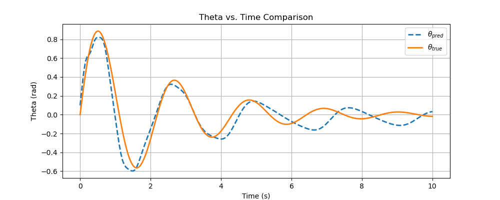

## PySINDY: Discovering a sparse expression for the equation of motion
This project explores the use of PySINDy (Sparse Identification of Nonlinear Dynamics) to rediscover governing equations of motion from simulated data.

We train symbolic models to learn the underlying dynamics of systems like:

- The damped pendulum  
- The Lorenz attractor  
- And other classical systems (chaotic and non-chaotic)  

The goal is to identify interpretable, sparse expressions that explain the observed trajectories — useful in understanding nonlinear behavior, dimensional reduction, and simulation validation.

Here we compare various training parameters and thresholds to see what best suits the dynamic system under study and why.

This project draws inspiration from the [PySINDy tutorial series by Prof. Alan Kaptanoglu](https://www.youtube.com/playlist?list=PLN90bHJU-JLoOfEk0KyBs2qLTV7OkMZ25).
